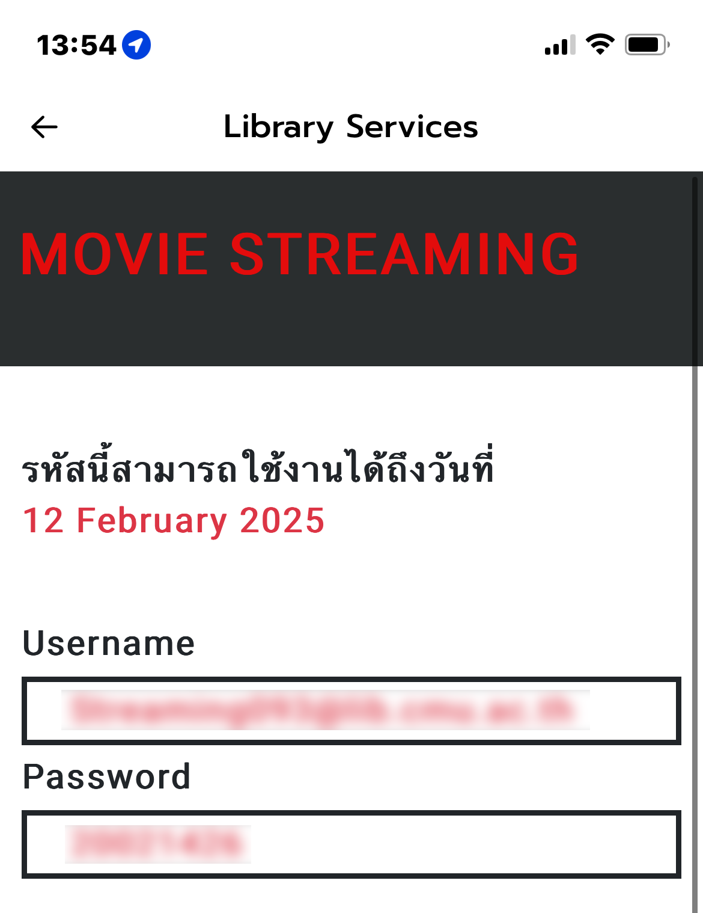

# Worked!
บอทกด Netflix Streaming Services ของมหาวิทยาลัยเชียงใหม่(ChiangMai University) WINRATE 100%<br/>
```*ยังไม่เคยมีคนทำ ใช้การแกะ API SERVICES ไม่ใช่ Auto Click หรือ Web Scrapping```<br/>
รีสิทธิ์ทุกๆวัน พุธ 14.00 PM จำนวนจำกัด (101) สิทธิ์ <br/>

1.เปิด CMD พิมพ์คำสั่ง py main.py<br/>
2.กรอก CMU Token *หาได้จากการทำ MITM PROXY แล้วดู network traffic ของ https://app.scmc.cmu.ac.th/api/v2/check-mobile-version GET headers: {Authorization: Bearer [YOUR TOKEN HERE!]}<br/>
3.นำ CMU Token มากรอก ใน CMD จากนั้นรอจนถึงเวลาและจะได้รับทันที<br/>

Copyright © 2025 รัฐนนท์ บุญมาตา(เพลย์ทู)


enjoy with your code<br/>


